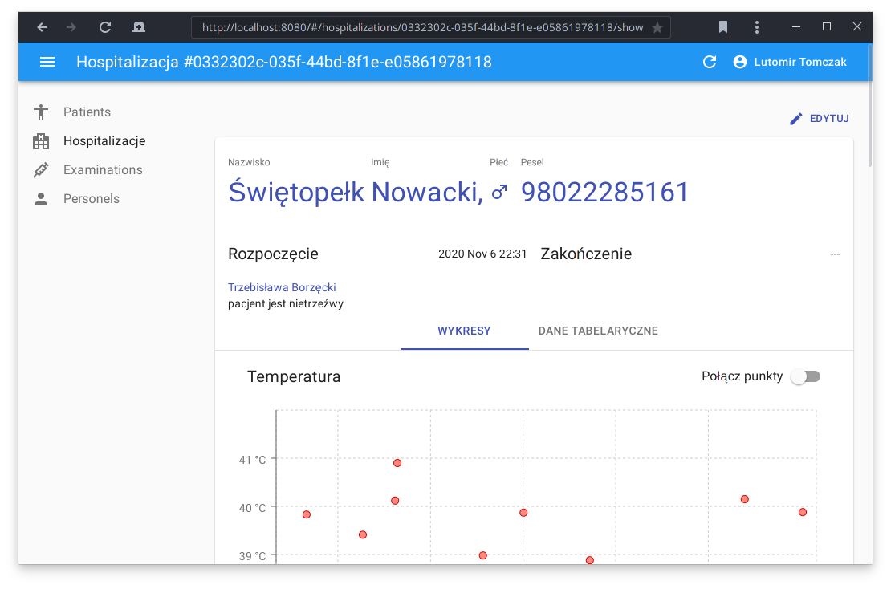
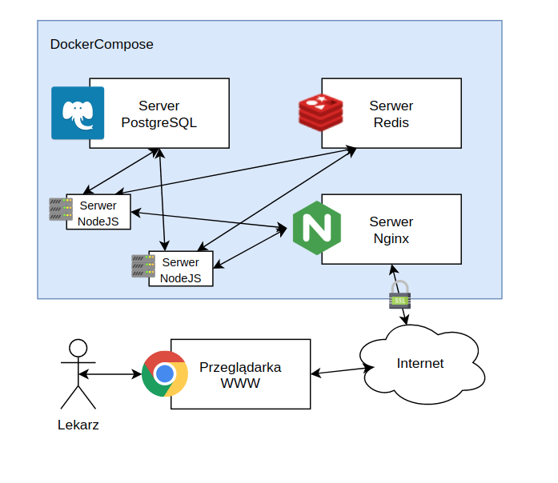
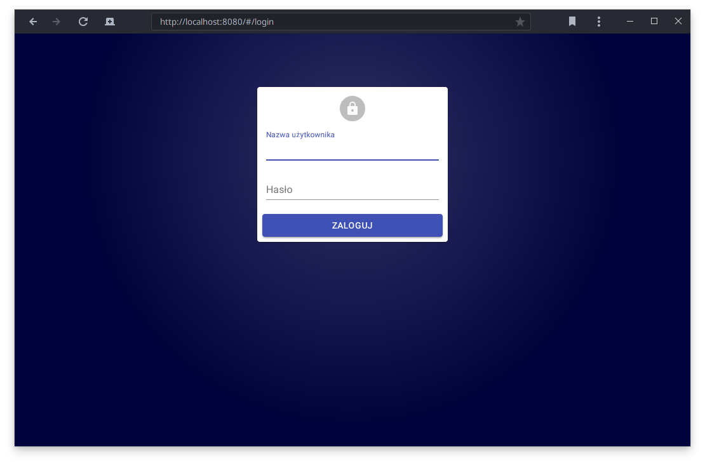
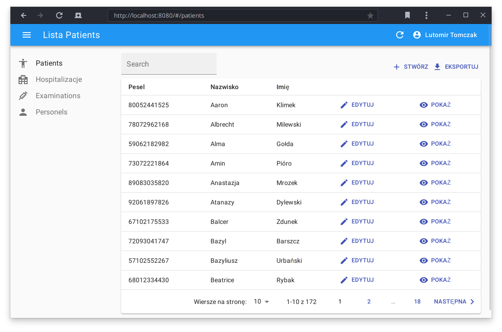
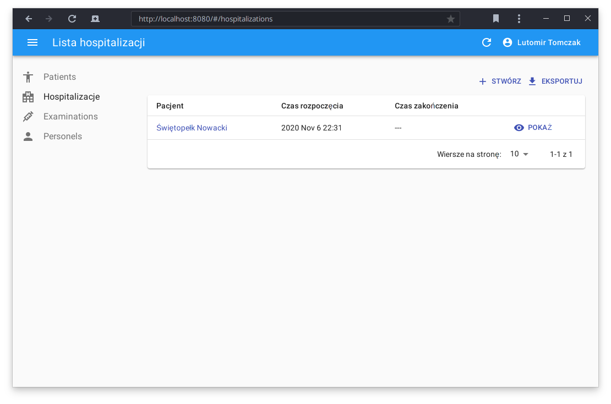
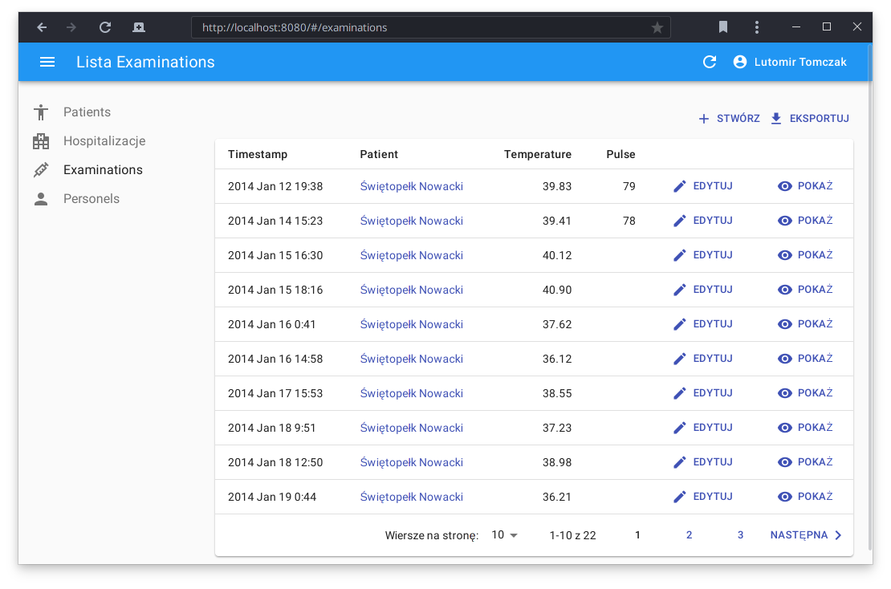
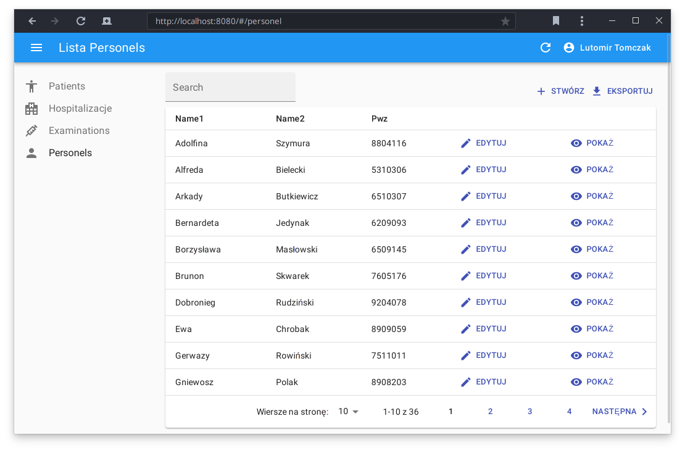
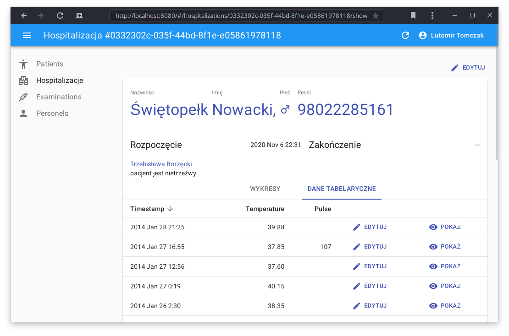
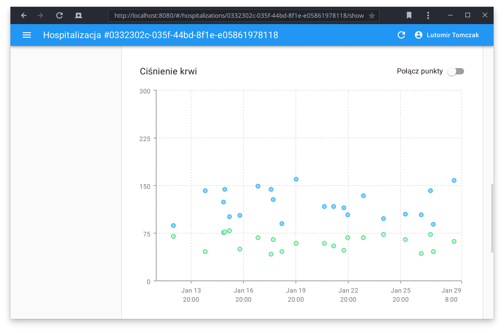

# TELM - eKarta Gorączkowa

***WSZYSTKIE DANE OSOBOWE W TYM PROJEKCIE ZOSTAŁY WYGENEROWANE LOSOWO !!!.***

Generator danych osobowych znajduje się w katalogu `database/generator/`



## Krótko o projekcie

Temat projektu:
```
1. Aplikacja Web z bazą danych e-karty gorączkowe dla oddziału szpitalnego
 - do zrealizowania jest przeglądarkowa aplikacja wykorzystująca serwer bazodanowy (np. Relacyjny, dokumentowy)
 - zalecany zespół 2 osobowy
```

Aplikacja jest pisana z myślą o uruchomianiu w środowisku skonteneryzowanym.

Do budowania aplikacji jest potrzebne: `nodejs` i `npm` lub [`docker`](https://docs.docker.com/get-docker/) i `docker-compose`

Aplikacja była przetestowana na środowisku Linuxowym.

W celu działania aplikacji należy posiadać zainicjowaną bazę danych, należy to zrobić tylko raz.
Baza będzie dostępna w katalogu `volume`.
Jak zainicjować bazę jest opisane w sekcjach poniżej.

### Uruchomianie w formie pokazowej (zalecane)

```shell script
docker-compose up
```
Powyższy skrypt zbuduje aplikacje i ją uruchomi.
Aby zakończyć działanie aplikacji, wciśnij `Ctrl+C`. 

Tak uruchomiana aplikacja niebędzie działać, bez zainicjowanej bazy danych. 
Zainicjuj bazy danych poniższymi komendami:
```shell script
docker-compose exec -T postgresql psql telm telm < database/extensions.sql
docker-compose exec -T postgresql psql telm telm < database/schema.sql
docker-compose exec -T postgresql psql telm telm < database/example_data.sql
```

Wejdź na stronę [localhost:8080](http://localhost:8080/).

Zaloguj się jako `ltomczak` z hasłem `qwerty123`;

### Uruchomianie testowych baz danych

Uruchom bazy danych PostgreSQL i Redis:

```shell script
docker-compose --env-file ".dev.env" --file "docker-compose.dev.yml" up
```

Uwaga: baza danych jest inicjowana z użytkownikiem `telm` i hasłem `SuperTajneHaslo`.

Aby połączyć się z bazą danych, proszę wpisać:
```shell script
psql --host=localhost --port=5001 --dbname=telm --username=telm
Password for user telm: SuperTajneHaslo
```

### Uruchamianie aplikacji w formie developerskiej

Zainstaluj zależności:
```shell script
npm install
```

W dwóch osobnych terminalach uruchom polecenia:
```shell script
npm run dev-build
npm run dev-serve
```

Wejdź na stronę [localhost:8080](http://localhost:8080/).

Uwaga: aby podłączyć inną bazę danych, niż ta domyśla, należy zmienieć parametry w pliku `.env`.

### Jak działa budowanie

Uruchamiając `npm run build`, uruchamia `webpack`'a, który pakuje cały projekt w kilka skompresowanych plików do katalogu `dist`, o następującej strukturze: 
```
├── dist
│   ├── private
│   │   └── main.js
│   └── public
│       ├── index.html
│       ├── main.js
│       ├── material-ui.js
│       ├── material-ui.js.LICENSE.txt
│       ├── react-admin.js
│       ├── react.js
│       ├── react.js.LICENSE.txt
│       ├── rechart.js
│       ├── vendor.js
│       └── vendor.js.LICENSE.txt
├── node_modules
└── package.json
```

Cały proces jest automatyczny i nie wymaga interakcji z użytkownikiem.

## Zmienne środowiskowe

Całą aplikacją można sterować za pomocą zmiennych środowiskowych.

| Nazwa | Wartość | Opis |
| --- | --- | --- |
| APP_SECRET | string | używany do podpisywania pliku cookie z identyfikatorem sesji |
| APP_PORT | number | port na którym zostanie uruchomiona aplikacja |
| APP_REDISURL | string | uri serwera Redis |
| APP_PGHOST | string | adres serwera PostgreSQL |
| APP_PGPORT | number | port serwera PostgreSQL |
| APP_PGDATABASE | string | nazwa bazy danych |
| APP_PGUSER | string | użytkownik do serwera PostgreSQL |
| APP_PGPASSWD | string | hasło do serwera PostgreSQL |

## Jak działa aplikacja

Aplikacja składa się z 4 procesów:
 - PostgreSQL - server z danymi aplikacji
 - Redis - serwer z sesjiami użytkowników
 - Nginz - tak zawany load balancer
 - Serwer NodeJS - serwer napisany przez nas



Użytkownik poprzez przeglądarkę łączy się z serwerem Nginx, który balansuje ruch pomiędzy uruchomione serwery NodeJS.
Serwery NodeJS łączą się z serwerem danych i sesji w celu obsługi żądania.

### Serwer backendowy

Serwer backendowy jest postawiony na wieloplatformowym środowisku uruchomieniowym NodeJS.

Serwer komunikuje się za pomocą RestAPI z klientem cienkim.
RestAPI zostało wykonane, przy użyciu biblioteki `express`.

### Interfejs graficzny strony

Interfejs graficzny został wykonany w `react`'cie.
Wykorzystano także bibliotekę `react-admin`, która ułatwia pisanie aplikacji do administrowania danymi.



Rys: Strona logowania


Rys: Lista pacjentów


Rys: Lista hospitalizacji


Rys: Lista pomiarów


Rys: Lista personelu


Rys: Widok hospitalizacji


Rys: Widok hospitalizacji, dane tabelaryczne


Rys: Widok hospitalizacji, ciśnienie krwi


## Baza danych


Baza danych została zaprojektowana za pomocą programu [pgModeler](https://pgmodeler.io/).
Jest to otwarto-źródłowy program, opublikowany na licencji GNU General Public License.

Baza danych składa się z 6 tabel:
 - `patients` - dane pacjentów
 - `hospitalizantions` - dane pobytów pacjentów, hostpitalizacje
 - `examinations` - badania wykonywane pacjentom
 - `personel` - personel medyczny
 - `basic_auth` - dane logowania
 - `logs` - logi dostępu do api

## Opis plików/katalogów

 - `database`
   - `generator`
   - `example_data.sql`
   - `model.dbm` - model bazy danych w programie [pgModeler](https://pgmodeler.io/)
   - `regen.sh` - skrypt do tworzenie dwóch następnych plików w `model.dbm`
   - `model.png` - model w postaci graficznej
   - `schema.sql` - model w postaci ddl
 - `src` - kod źródłowy
   - `backend` - część serwerowa
   - `frontend` - część przeglądarkowa
   - `data` - część danych, ich definicje i walidatory
 - `docker-compose.dev.yml` - pliki orkiestratora (wersja deweloperska)
 - `docker-compose.yml` - pliki orkiestratora 
   
## Użyte biblioteki

Sumaryczna użyta ilość bibliotek i narzędzi to: ( ͡° ͜ʖ ͡° )つ──☆*:・ﾟ **1257**.
Liczbę można uzyskać uruchamiając `npm ls --parseable | wc -l`.


A na poważnie: użyliśmy narzędzia `npm` do rozwiązywania zależności.
Sprawia to, że podczas instalowania bibliotek w katalogu `node_modules` wraz z zależnościami do tych bibliotek i tak w kółko.
Pełny wykaz bibliotek znajduje się w pliku `dependencies.txt`, a biblioteki faktyczne użyte przez nas są w pliku `package.json` w sekcjach dependencies i `devDependencies`.

Najważniejsze biblioteki:

 - `react` - główna biblioteka graficzna
 - `react-admin` - biblioteka do tworzenia stron typu dashboard z danymi 
 - `@material-ui/core` - biblioteka graficzna w stylu Material 
 - `@date-io/dayjs` - biblioteka do obsługi czasu
 - `yup` - biblioteka do walidacji danych
 - `recharts` - biblioteka do rysowania grafów
 - `typescript` - język javascript z typowaniem
 - `webpack` - narzędzie do kompilowania i pakowania kodu
 - `express` - biblioteka do tworzenia serwera HTTP
 - `pg` - biblioteki do obsługi bazy PostgreSQL
 - `knex` - biblioteki generowania dynamicznych zapytań SQL
 

## Autorzy

 - Adam Jędrzejowski <a.jedrzejowski@gmail.com>
 - Ewelina Drelich <ewe.drelich@gmail.com>
